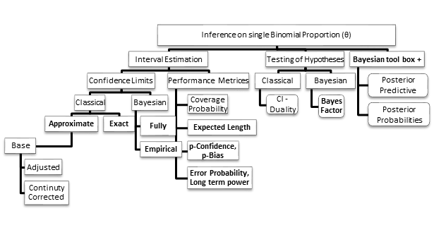

## Introduction
Let x denote the number of successes in n independent Bernoulli trials with X ~ Binomial (n, p) then  $\hat p = x/n$ denotes the sample proportion. Single binomial proportion (p) has drawn appreciable research attention with theoretical, applied, and pedagogic objectives. Such interest has been intensified further when Classical, Bayesian, and Bootstrap approaches are providing candidate intervals to enrich this literature. Specifically,

- M. Thulin, (2014 a, b), W. Wang (2014), B. Lecoutre and J. Poitevineau (2014), Wei Yu (2012), Zhou, X. H., Li, C.M. and Yang, Z (2008) - Aiming to improve methods methodologically
- K. Breitung and MA. Maes (2015), AM. Andres and MA. Hernandez (2014, 2015), V. RG. Newcombe (2011), C. Damgaard and A. Fayolle (2011), Tuyl F, Gerlach R and Mengersen K (2008), Vos PW and Hudson S (2005), Reiczigel J (2003), Pires (2002) - Comparison of methods with one or two evaluation metrics
- Pradhan, JC. Evans and T. Banerjee (2013), Newcombe RG (2007), Lewis JR and Sauro J (2006), Sauro J and Lewis JR (2005), Bolboaca S and Cadariu AA (2003), Henderson M and Meyer MC (2001) - Application in various fields and recommendations for teaching practices.

This package has identified scope to collate widely or frequently used methods involved in the inferential problems regarding p and prominent procedures for comparing in terms of their performance. This includes two major statistical paradigms, Classical and Bayesian; especially, later provides a list of tools to broaden this scope.


Methods for finding confidence interval for p include methods

1. Based on the asymptotic normality of the sample proportion and estimating standard error,
2. Exact methods based on inverting equal-tailed binomial tests of $H_0 : p = p_0$,
3. Methods based on likelihood ratios 
4. Bayesian approaches with beta priors or other suitable priors. 

Apart from this testing of hypotheses involving p and measures based on posterior in Bayesian approach have drawn active research interest.   

Objective of this package is to present interval estimation procedures for 'p' outlined above in a more comprehensive way. Performance assessment of these procedures such as coverage probability, Expected length, Error, p-confidence and p-bias are included. Also, an array of Bayesian computations (Bayes factor, Empirical Bayesian, Posterior predictive computation, and posterior probability) with conjugate prior is made available. More importantly package has aimed to complement the summaries using more appropriate graphical forms that enhance the presentation and teaching activities. 


## Workflow
Following Figure depicts the way this inferential problem can be understood so as to expand the scope of computations; **bold face** indicates modification of existing procedures or addition of new procedures such as t-distribution based Wald method that are not available for wider audience.  



###Notations Used

1.	x: Number of successes
2.	n: Number of trials 
3.	$\alpha$: Level of significance
4.	e: Exact method indicator  in [0, 1] {1: Clopper Pearson, 0.5: Mid P}. In all exact functions you can set a range of values between 0 and 1. 
5.	a and b: Beta parameters for hypothetical parameter generation; Prior parameters in Bayesian predictive models 
6.	t1 and t2: Limits for tolerance (within which CP lies)
7.	$\pi$: Population parameter
8.	f: Failure limit
9.	h: Constant used in adjustment methods
10.	c: Constant used in continuity corrected methods
11.	$a_1,a_2$: Prior parameters in Bayesian estimation procedures
12.	LL, UL: Lower and Upper limits for the intervals due to any other methods
13.	s: Number of simulations 
14.	hp: Hypothetical parameter values 
15.	sL, sU: Lower and Upper specification for hyper prior in Empirical Bayesian (EB) approach
16.	m, xnew: Number of trials and number of successes in Bayesian predictive models
17.	th0, th1, th2: Parameter values in the models $M_0, M_1, M_2$ of Bayes factor 
18.	$a_j, b_j$: Prior parameters in the models $M_j (j = 0, 1, 2)$ of Bayes factor
19.	th: Parameter value in Bayesian posterior probabilities

### Naming comvention used in the package
```{r, echo=FALSE, results='asis'}
# 00.Naming convention
Naming.convention = matrix( c("ci, ciA, ciC","Confidence Interval, adjusted CI and continuity corrected CI",
"covp, covpA, covpC","Coverage Probability, adjusted CP & continuity corrected CP",
"expl, explA, explC ","Expected Length, adjusted Expected Length & continuity corrected EL",
"length, lengthA, lengthC","Sum of Length, adjusted Sum of Length & continuity corrected sumLen",
"pCOpBI, pCOpBIA, pCOpBIC","p-Confidence & p-Bias, adjusted p-Conf & p-Bias ",
"","and continuity corrected p-Confidence & p-Bias",
"err, errA, errC","Error, adjusted error and continuity corrected error",
"AS","ArcSine",
"LR","Likelihood Ratio",
"LT","Logit Wald",
"SC","Score",
"TW","Wald-T",
"WD","Wald",
"All","6 base methods - Wald, Wald-T, Logit Wald, ArcSine, LR, Score",
"AAll","6 adj methods - Wald, Wald-T, Logit Wald, ArcSine, LR, Score",
"CAll","5 cont. corr. methods - Wald, Wald-T, Logit Wald, ArcSine,  Score",
"BA","Bayesian",
"EX" ,"Exact - setting e=0.5 gives mid-p and e=1 gives Clopper-Pearson"),byrow=TRUE, nrow=18,  ncol=2)

colnames(Naming.convention)=c("Abbrivation", "Expansion")

knitr::kable(Naming.convention,caption = "Naming convention used in functions")
```

```{r, echo=FALSE, results='asis'}
# 000.Function identification
Identify.Function = matrix( c("Plot","ci","A","AS","x","ci + A + AS + x =","ciAASx",
"","covp","C","SC","","Plot + ci + A + AS + x =","PlotciAASx",
"","expl","","BA","","Plot + covp + C + SC =","PlotcovpCSC",
"","length","","EX","","expl + A + TW =","explATW",
"","pCOpBI","","TW","","expl + A + TW + x =","explATWx",
"","err","","LT","","length + WD =","lenghtWD",
"","","","WD","","length + A + WD =","lengthAWD",
"","","","LR","","length + C + WD =","lengthCWD"),byrow=TRUE, nrow=8,  ncol=7)

colnames(Identify.Function)=c("Plot", "Concept","Modifications", "Name","Single x","Sample combination","Sample function")

knitr::kable(Identify.Function,caption = "Guide to identify core functions - Plot, Modifications and x are optional")
```


## Confidence Interval
```{r, echo=FALSE, results='asis'}
# 1.ci
Numeric.ci = matrix( c("ciAS","ciASx","ciAAS","ciAASx","ciCAS","ciCASx",
"ciLR","ciLRx","ciALR","ciALRx","","",
"ciLT","ciLTx","ciALT","ciALTx","ciCLT","ciCLTx",
"ciSC","ciSCx","ciASC","ciASCx","ciCSC","ciCSCx",
"ciTW","ciTWx","ciATW","ciATWx","ciCTW","ciCTWx",
"ciWD","ciWDx","ciAWD","ciAWDx","ciCWD","ciCWDx",
"ciAll","ciAllx","ciAAll","ciAAllx","ciCAll","ciCAllx",
"ciBA","ciBAx","","","","",
"ciEX","ciEXx","","","",""),byrow=TRUE, nrow=9,  ncol=6)


colnames(Numeric.ci)=c("Basic","Basic-x","Adj","Adj-x","CC","CC-x")
rownames(Numeric.ci)=c("ArcSine", "LR","Logit","Score","Wald-T","Wald","All","Bayes","Exact")

knitr::kable(Numeric.ci,caption = "Confidence Interval")
```


```{r, echo=FALSE, results='asis'}
# 6. Plot ci
Plot.ci = matrix( c("PlotciAS","","PlotciAAS","","PlotciCAS","",
"PlotciLR","","PlotciALR","","","",
"PlotciLT","","PlotciALT","","PlotciCLT","",
"PlotciSC","","PlotciASC","","PlotciCSC","",
"PlotciTW","","PlotciATW","","PlotciCTW","",
"PlotciWD","","PlotciAWD","","PlotciCWD","",
"PlotciAllg","PlotciAllxg","PlotciAAllg","PlotciAAllxg","PlotciCAllg","PlotciCAllxg",
"PlotciAll","PlotciAllx","PlotciAAll","PlotciAAllx","PlotciCAll","PlotciCAllx",
"PlotciBA","","","","","",
"PlotciEX","PlotciEXx","","","",""),byrow=TRUE, nrow=10,  ncol=6)

colnames(Plot.ci)=c("Basic","Basic-x","Adj","Adj-x","CC","CC-x")
rownames(Plot.ci)=c("ArcSine", "LR","Logit","Score","Wald-T","Wald","Allg","All","Bayes","Exact")

knitr::kable(Plot.ci,caption = "Plotting functions of CI")
```


### 1. CONFIDENCE INTERVAL- BASE METHODS 

1.	__Wald:__  
Wald-type interval that results from inverting large-sample test and evaluates standard errors at maximum likelihood estimates for all $x = 0, 1, 2 ..n.$
2.	__Score:__  
A score test approach based on inverting the test with standard error evaluated at the null hypothesis is due to Wilson for all $x = 0, 1, 2 ..n.$
3.	__ArcSine:__  
Wald-type interval for all $x = 0, 1, 2 ..n.$ using the arcsine transformation of the parameter $p$; that is based on the normal approximation for $sin^{-1}(p)$ 
4.	__Logit Wald:__  
Wald-type interval for all $x = 0, 1, 2 ..n.$ based on the logit transformation of $p$; that is that is normal approximation for $log\frac{p}{1-p}$
5.	__Wald-t:__  
An approximate method based on a t_approximation of the standardized point estimator for all $x = 0, 1, 2 ..n.$; that is the point estimator divided by its estimated standard error. Essential boundary modification is when $x = 0$ or $n$,  $\hat p =\frac{x+2}{n+4}$
6.	__Likelihood Ratio:__  
Likelihood ratio limits for all $x = 0, 1, 2 ..n.$ obtained as the solution to the equation in $p$ formed as logarithm of ratio between binomial likelihood at sample proportion and that of over all possible parameters
7.	__Exact:__  
Confidence interval for $p$ (for all $x = 0, 1, 2 ..n.$), based on inverting equal-tailed binomial tests with null hypothesis $H_0: p = p_0$ and calculated from the cumulative binomial distribution. Exact two sided P-value is usually calculated as $P= 2[ePr(X = x) + min{Pr(X < x), Pr(X > x)}]$ where probabilities are found at null value of $p$ and $0 \le e \le 1$. 
8.	__Bayesian:__  
Highest Probability Density (HPD) and two tailed intervals are provided for all $x = 0, 1, 2 ..n$ based on the conjugate prior beta $(a, b)$ for the probability of success $p$ of the binomial distribution so that the posterior is beta $(x + a, n - x + b)$.


### 2.CONFIDENCE INTERVAL- ADJUSTED METHODS 

1.	__Wald:__  
Given data $x$ and $n$ are modified as $x + h$ and $n + (2*h)$ respectively, where $h > 0$ then Wald-type interval is applied for all $x = 0, 1, 2 ..n.$
2.	__Score:__  
A score test approach is used after the given data $x$ and $n$ are modified as $x + h$ and $n + (2*h)$ respectively, where $h > 0$ and for all $x = 0, 1, 2 ..n.$
3.	__ArcSine:__  
Wald-type interval for the arcsine transformation of the parameter $p$ for the modified data $x + h$ and $n + (2*h)$, where $h > 0$ and for all $x = 0, 1, 2 ..n.$
4.	__Logit Wald:__  
Wald-type interval for the logit transformation $log\frac{p}{1-p}$ of the parameter $p$ for the modified data $x + h$ and $n + (2*h)$, where $h > 0$  and for all $x = 0, 1, 2 ..n.$
5.	__Wald-t:__  
Given data $x$ and $n$ are modified as $x + h$ and $n + (2*h)$ respectively, where $h > 0$ then approximate method based on a t_approximation of the standardized point estimator for all $x = 0, 1, 2 ..n.$
6.	__Likelihood Ratio:__  
Likelihood ratio limits for the data $x + h$ and $n + (2*h)$ instead of the given $x$ and $n$, where $h$ is a positive integer $(1, 2.)$ and for all $x = 0, 1, 2 ..n.$


### 3.CONFIDENCE INTERVAL- CONTINUITY CORRECTED METHODS 

1.	__Wald:__  
Wald-type interval (for all $x = 0, 1, 2 ..n$) using the test statistic $\frac{|\hat p - p| -c}{SE}$  where $c > 0$ is a constant for continuity correction
2.	__Score:__  
A score test approach using the test statistic $\frac{|\hat p - p| -c}{SE}$ where $0 < c < 1/(2n)$ is a constant for continuity correction for all $x = 0, 1, 2 ..n.$
3.	__ArcSine:__  
Wald-type interval for the arcsine transformation using the test statistic  $\frac{|sin^{-1}\hat p - sin^{-1}p| -c}{SE}$  where $c > 0$ is a constant for continuity correction and for all  $x = 0, 1, 2 ..n.$ 
4.	__Logit Wald:__  
Wald-type interval for the logit transformation of the parameter p using the test statistic  $\frac{|L(\hat p) - L(p)| -c}{SE}$ where $c > 0$ is a constant for continuity correction and $L(x) = log\frac{x}{1-x}$ for all $x = 0, 1, 2 ..n.$ Boundary modifications when $x = 0$ or $x = n$ using Exact method values. 
5.	__Wald-t:__  
Approximate method based on a t_approximation of the standardized point estimator using the test statistic $\frac{|\hat p - p|-c}{SE}$ where $c > 0$ is a constant for continuity correction for all $x = 0, 1, 2 ..n.$ Boundary modifications when $x = 0$ or $x = n$  using Wald adjustment method with $h = 2$.

## Coverage Probability
```{r, echo=FALSE, results='asis'}
# 2. covp
Numeric.covp = matrix( c("covpAS","covpAAS","covpCAS",
"covpLR","covpALR","",
"covpLT","covpALT","covpCLT",
"covpSC","covpASC","covpCSC",
"covpTW","covpATW","covpCTW",
"covpWD","covpAWD","covpCWD",
"covpAll","covpAAll","covpCAll",
"covpBA","","",
"covpEX","",""),byrow=TRUE, nrow=9,  ncol=3)


colnames(Numeric.covp)=c("Basic","Adjusted","Continuity corrected")
rownames(Numeric.covp)=c("ArcSine", "LR","Logit","Score","Wald-T","Wald","All","Bayes","Exact")

knitr::kable(Numeric.covp,caption = "Coverage Probability")
```


```{r, echo=FALSE, results='asis'}
# 7. Plot covp
Plot.covp = matrix( c("PlotcovpAS","PlotcovpAAS","PlotcovpCAS",
"PlotcovpLR","PlotcovpALR","",
"PlotcovpLT","PlotcovpALT","PlotcovpCLT",
"PlotcovpSC","PlotcovpASC","PlotcovpCSC",
"PlotcovpTW","PlotcovpATW","PlotcovpCTW",
"PlotcovpWD","PlotcovpAWD","PlotcovpCWD",
"PlotcovpAll","PlotcovpAAll","PlotcovpCAll",
"PlotcovpBA","","",
"PlotcovpEX","",""),byrow=TRUE, nrow=9,  ncol=3)

colnames(Plot.covp)=c("Basic","Adjusted","Continuity corrected")
rownames(Plot.covp)=c("ArcSine", "LR","Logit","Score","Wald-T","Wald","All","Bayes","Exact")

knitr::kable(Plot.covp,caption = "Plotting functions of Coverage Probability")
```

### 4.Metric 1:COVERAGE PROBABILITY (Applicable to Base, Adjusted and Continuity Corrected Methods)

1.	__Wald:__  
Evaluation of Wald-type interval using coverage probability, root mean square statistic, and the proportion of proportion lies within the desired level of coverage
2.	__Score:__  
Evaluation of score test approach using coverage probability, root mean square statistic, and the proportion of proportion lies within the desired level of coverage
3.	__ArcSine:__  
Evaluation of Wald-type interval for the arcsine transformation of the parameter $p$ using coverage probability, root mean square statistic, and the proportion of proportion lies within the desired level of coverage 
4.	__Logit Wald:__  
Evaluation of Wald-type interval based on the logit transformation of $p$ using coverage probability, root mean square statistic, and the proportion of proportion lies within the desired level of coverage
5.	__Wald-t:__  
Evaluation of approximate method based on a t_approximation of the standardized point estimator using coverage probability, root mean square statistic, and the proportion of proportion lies within the desired level of coverage
6.	__Likelihood Ratio:__  
Evaluation of Likelihood ratio limits using coverage probability, root mean square statistic, and the proportion of proportion lies within the desired level of coverage
7.	__Exact:__  
Evaluation of Confidence interval for p based on inverting equal-tailed binomial tests with null hypothesis H0: p = p0 using coverage probability, root mean square statistic, and the proportion of proportion lies within the desired level of coverage. 
8.	__Bayesian:__  
Evaluation of Bayesian Highest Probability Density (HPD) and two tailed intervals using coverage probability, root mean square statistic, and the proportion of proportion lies within the desired level of coverage for the Beta - Binomial conjugate prior model for the probability of success $p$. 

## Length
```{r, echo=FALSE, results='asis'}
# 3. Length
Numeric.length = matrix( c("lengthAS","lengthAAS","lengthCAS",
"lengthLR","lengthALR","",
"lengthLT","lengthALT","lengthCLT",
"lengthSC","lengthASC","lengthCSC",
"lengthTW","lengthATW","lengthCTW",
"lengthWD","lengthAWD","lengthCWD",
"lengthAll","lengthAAll","lengthCAll",
"lengthBA","","",
"lengthEX","",""),byrow=TRUE, nrow=9,  ncol=3)

colnames(Numeric.length)=c("SumLen","Adj-SumLen","CC-SumLen")
rownames(Numeric.length)=c("ArcSine", "LR","Logit","Score","Wald-T","Wald","All","Bayes","Exact")

knitr::kable(Numeric.length,caption = "Sum of length")
```

```{r, echo=FALSE, results='asis'}
# 8. Plot length
Plot.covp = matrix( c("PlotlengthAS","PlotexplAS","PlotlengthAAS","PlotexplAAS","PlotlengthCAS","PlotexplCAS",
"PlotlengthLR","PlotexplLR","PlotlengthALR","PlotexplALR","","",
"PlotlengthLT","PlotexplLT","PlotlengthALT","PlotexplALT","PlotlengthCLT","PlotexplCLT",
"PlotlengthSC","PlotexplSC","PlotlengthASC","PlotexplASC","PlotlengthCSC","PlotexplCSC",
"PlotlengthTW","PlotexplTW","PlotlengthATW","PlotexplATW","PlotlengthCTW","PlotexplCTW",
"PlotlengthWD","PlotexplWD","PlotlengthAWD","PlotexplAWD","PlotlengthCWD","PlotexplCWD",
"PlotlengthAll","PlotexplAll","PlotlengthAAll","PlotexplAAll","PlotlengthCAll","PlotexplCAll",
"PlotlengthBA","PlotexplBA","","","","",
"PlotlengthEX","PlotexplEX","","","",""),byrow=TRUE, nrow=9,  ncol=6)

#colnames(Plot.covp)=c("Basic","Adjusted","Continuity corrected")
colnames(Plot.covp)=c("SumLen","EL","Adj-SumLen","Adj-EL","CC-SumLen","CC-EL")
rownames(Plot.covp)=c("ArcSine", "LR","Logit","Score","Wald-T","Wald","All","Bayes","Exact")

knitr::kable(Plot.covp,caption = "Plotting functions of sum length and expected length (EL)")
```

### 4.Metric 2:EXPECTED LENGTH (Applicable to Base, Adjusted and Continuity Corrected Methods)

1.	__Wald:__  
Evaluation of Wald-type intervals using expected length of the $n + 1$ intervals
2.	__Score:__  
Evaluation of score test approach using expected length of the $n + 1$ intervals
3.	__ArcSine:__  
Evaluation of Wald-type interval for the arcsine transformation of the parameter p using expected length of the $n + 1$ intervals 
4.	__Logit Wald:__  
Evaluation of Wald-type interval based on the logit transformation of p using expected length of the $n + 1$ intervals
5.	__Wald-t:__  
Evaluation of approximate method based on a t_approximation of the standardized point estimator using expected length of the $n + 1$ intervals
6.	__Likelihood Ratio:__  
Evaluation of Likelihood ratio limits using expected length of the $n + 1$ intervals
7.	__Exact:__  
Evaluation of Confidence interval for p based on inverting equal-tailed binomial tests with null hypothesis $H_0: p = p_0$ using expected length of the $n + 1$ intervals.
8.	__Bayesian:__  
Evaluation of Bayesian Highest Probability Density (HPD) and two tailed intervals using expected length of the $n + 1$ intervals for the Beta - Binomial conjugate prior model for the probability of success $p$. 

## p-Confidence & p-Bias
```{r, echo=FALSE, results='asis'}
# 4. p-Confidence & p-Bias	
Numeric.pcpb = matrix( c("pCOpBIAS","pCOpBIAAS","pCOpBICAS",
"pCOpBILR","pCOpBIALR","",
"pCOpBILT","pCOpBIALT","pCOpBICLT",
"pCOpBISC","pCOpBIASC","pCOpBICSC",
"pCOpBITW","pCOpBIATW","pCOpBICTW",
"pCOpBIWD","pCOpBIAWD","pCOpBICWD",
"pCOpBIAll","pCOpBIAAll","pCOpBICAll",
"pCOpBIBA","","",
"pCOpBIEX","",""),byrow=TRUE, nrow=9,  ncol=3)

colnames(Numeric.pcpb)=c("Basic","Adjusted","Continuity corrected")
rownames(Numeric.pcpb)=c("ArcSine", "LR","Logit","Score","Wald-T","Wald","All","Bayes","Exact")

knitr::kable(Numeric.pcpb,caption = "p-Confidence & p-Bias")
```

```{r, echo=FALSE, results='asis'}
# 9. Plot p-Confidence & p-Bias
Plot.pcpb = matrix( c("PlotpCOpBIAS","PlotpCOpBIAAS","PlotpCOpBICAS",
"PlotpCOpBILR","PlotpCOpBIALR","",
"PlotpCOpBILT","PlotpCOpBIALT","PlotpCOpBICLT",
"PlotpCOpBISC","PlotpCOpBIASC","PlotpCOpBICSC",
"PlotpCOpBITW","PlotpCOpBIATW","PlotpCOpBICTW",
"PlotpCOpBIWD","PlotpCOpBIAWD","PlotpCOpBICWD",
"PlotpCOpBIAll","PlotpCOpBIAAll","PlotpCOpBICAll",
"PlotpCOpBIBA","","",
"PlotpCOpBIEX","",""),byrow=TRUE, nrow=9,  ncol=3)


colnames(Plot.pcpb)=c("Basic","Adjusted","Continuity corrected")
rownames(Plot.pcpb)=c("ArcSine", "LR","Logit","Score","Wald-T","Wald","All","Bayes","Exact")

knitr::kable(Plot.pcpb,caption = "Plotting functions for p-Confidence & p-Bias")
```

### 5.Metric 3:p-CONFIDENCE, p-BIAS (BASE METHOD)

1.	__Wald:__  
Evaluation of Wald-type intervals using p-confidence and p-bias for the $n + 1$ intervals
2.	__Score:__  
Evaluation of score test approach using p-confidence and p-bias for the $n + 1$ intervals
3.	__ArcSine:__  
Evaluation of Wald-type interval for the arcsine transformation of the parameter p using p-confidence and p-bias for the $n + 1$ intervals 
4.	__Logit Wald:__  
Evaluation of Wald-type interval based on the logit transformation of p using p-confidence and p-bias for the $n + 1$ intervals
5.	__Wald-t:__  
Evaluation of approximate method based on a t_approximation of the standardized point estimator using p-confidence and p-bias for the $n + 1$ intervals
6.	__Likelihood Ratio:__  
Evaluation of Likelihood ratio limits using p-confidence and p-bias for the $n + 1$ intervals
7.	__Exact:__  
Evaluation of Confidence interval for p based on inverting equal-tailed binomial tests with null hypothesis $H_0: p = p_0$ using p-confidence and p-bias for the $n + 1$ intervals.
8.	__Bayesian:__  
Evaluation of Bayesian Highest Probability Density (HPD) and two tailed intervals using p-confidence and p-bias for the $n + 1$ intervals for the Beta - Binomial conjugate prior model for the probability of success $p$. 

### 6.Metric 3:p-CONFIDENCE, p-BIAS (Applicable to Base, Adjusted and Continuity Corrected Methods)

1.	__Wald:__  
Evaluation of adjusted Wald-type interval using p-confidence and p-bias for the $n + 1$ intervals
2.	__Score:__  
Evaluation of adjusted score test approach using p-confidence and p-bias for the $n + 1$ intervals
3.	__ArcSine:__  
Evaluation of adjusted Wald-type interval for the arcsine transformation of the parameter $p$ using p-confidence and p-bias for the $n + 1$ intervals 
4.	__Logit Wald:__  
Evaluation of adjusted Wald-type interval based on the logit transformation of $p$ using p-confidence and p-bias for the $n + 1$ intervals
5.	__Wald-t:__  
Evaluation of approximate and adjusted method based on a t_approximation of the standardized point estimator using p-confidence and p-bias for the $n + 1$ intervals
6.	__Likelihood Ratio:__  
Evaluation of adjusted Likelihood ratio limits using p-confidence and p-bias for the $n + 1$ intervals

## Error and long term power
```{r, echo=FALSE, results='asis'}
# 5. Error and long term power
Numeric.error = matrix( c("errAS","errAAS","errCAS",
"errLR","errALR","",
"errLT","errALT","errCLT",
"errSC","errASC","errCSC",
"errTW","errATW","errCTW",
"errWD","errAWD","errCWD",
"errAll","errAAll","errCAll",
"errBA","","",
"errEX","",""),byrow=TRUE, nrow=9,  ncol=3)

colnames(Numeric.error)=c("Basic","Adjusted","Continuity corrected")
rownames(Numeric.error)=c("ArcSine", "LR","Logit","Score","Wald-T","Wald","All","Bayes","Exact")

knitr::kable(Numeric.error,caption = "Error and long term power")
```
```{r, echo=FALSE, results='asis'}
# 10. Plot error and long term power
Plot.error = matrix( c("PloterrAS","PloterrAAS","PloterrCAS",
"PloterrLR","PloterrALR","",
"PloterrLT","PloterrALT","PloterrCLT",
"PloterrSC","PloterrASC","PloterrCSC",
"PloterrTW","PloterrATW","PloterrCTW",
"PloterrWD","PloterrAWD","PloterrCWD",
"PloterrAll","PloterrAAll","PloterrCAll",
"PloterrBA","","",
"PloterrEX","",""),byrow=TRUE, nrow=9,  ncol=3)


colnames(Plot.error)=c("Basic","Adjusted","Continuity corrected")
rownames(Plot.error)=c("ArcSine", "LR","Logit","Score","Wald-T","Wald","All","Bayes","Exact")

knitr::kable(Plot.error,caption = "Plotting functions for error and long term power")
```

### 7.Metric 4:ERROR (Applicable to Base, Adjusted and Continuity Corrected Methods)

1.	__Wald:__  
Evaluation of Wald-type intervals using error due to the difference of achieved and nominal level of significance for the $n + 1$ intervals
2.	__Score:__  
Evaluation of score test approach using error due to the difference of achieved and nominal level of significance for the $n + 1$ intervals
3.	__ArcSine:__  
Evaluation of Wald-type interval for the arcsine transformation of the parameter $p$ error due to the difference of achieved and nominal level of significance for the $n + 1$ intervals 
4.	__Logit Wald:__  
Evaluation of Wald-type interval based on the logit transformation of $p$ using error due to the difference of achieved and nominal level of significance for the $n + 1$ intervals
5.	__Wald-t:__  
Evaluation of approximate method based on a t_approximation of the standardized point estimator using error due to the difference of achieved and nominal level of significance for the $n + 1$ intervals
6.	__Likelihood Ratio:__  
Evaluation of Likelihood ratio limits using error due to the difference of achieved and nominal level of significance for the $n + 1$ intervals
7.	__Exact:__  
Evaluation of Confidence interval for p based on inverting equal-tailed binomial tests with null hypothesis $H_0: p = p_0$ using error due to the difference of achieved and nominal level of significance for the $n + 1$ intervals.
8.	__Bayesian:__  
Evaluation of Bayesian Highest Probability Density (HPD) and two tailed intervals using error due to the difference of achieved and nominal level of significance for the $n + 1$ intervals for the Beta - Binomial conjugate prior model for the probability of success $p$. 

### 8. EVALUATION METHODS FOR GENERAL APPROACH

1.	Evaluation of intervals obtained from any method using coverage probability, root mean square statistic, and the proportion of proportion lies within the desired level of coverage for the $n + 1$ intervals and pre-defined space for the parameter $p$ using Monte Carle simulation
2.	Graphical evaluation of intervals obtained from any method using coverage probability, root mean square statistic, and the proportion of proportion lies within the desired level of coverage for the $n + 1$ intervals and pre-defined space for the parameter $p$ using Monte Carle simulation

## Additional functions
```{r, echo=FALSE, results='asis'}
# 11. Others
Other.functions = matrix( c("hypotestBAF1","covpGEN","lengthGEN","pCOpBIGEN","empericalBA","errGEN",
"hypotestBAF1x","PlotcovpGEN","PlotlengthGEN","PlotpCOpBIGEN","empericalBAx","",
"hypotestBAF2x","covpSIM","lengthSIM","","probPOSx","",
"hypotestBAF2","PlotcovpSIM","PlotlengthSIM","","probPOS","",
"hypotestBAF3x","","PlotexplGEN","","probPREx","",
"hypotestBAF3","","PlotexplSIM","","probPRE","",
"hypotestBAF4x","","","","","",
"hypotestBAF4","","","","","",
"hypotestBAF5x","","","","","",
"hypotestBAF5","","","","","",
"hypotestBAF6x","","","","","",
"hypotestBAF6","","","","",""),byrow=TRUE, nrow=12,  ncol=6)

colnames(Other.functions)=c("Hypothesis","covp","length","pCOpBI","Others","Error")

knitr::kable(Other.functions,caption = "Additional functions")
```

### 9. Testing of hypothesis and other functions for Bayesian method 

1.	__EBA:__  
Highest Probability Density (HPD) and two tailed intervals are provided for all $x = 0, 1, 2 ..n$ based on empirical Bayesian approach for Beta-Binomial model. Lower and Upper support values are needed to obtain the MLE of marginal likelihood for prior parameters.
2.	__probPRE:__  
Computes posterior predictive probabilities for the required size of number of trials ($m$) from the given number of trials (n) for the given parameters for Beta prior distribution
3.	__hypotestBAF1:__  
Computes Bayes factor under Beta-Binomial model for the model: $H_0: p = p_0$ Vs $H_A: p \ne p_0$ from the given number of trials n and for all number of successes $x = 0, 1, 2......n$ 
4.	__hypotestBAF2:__  
Computes Bayes factor under Beta-Binomial model for the model: $H_0: p = p_0$ Vs $H_A: p > p_0$ from the given number of trials n and for all number of successes $x = 0, 1, 2......n$ 
5.	__hypotestBAF3:__  
Computes Bayes factor under Beta-Binomial model for the model: $H_0: p = p_0$ Vs $H_A: p < p_0$ from the given number of trials n and for all number of successes $x = 0, 1, 2......n$ 
6.	__hypotestBAF4:__  
Computes Bayes factor under Beta-Binomial model for the model: $H_0: p \le p_0$ Vs $H_A: p > p_0$ from the given number of trials n and for all number of successes $x = 0, 1, 2......n$ 
7.	__hypotestBAF5:__  
Computes Bayes factor under Beta-Binomial model for the model: $H_0: p \ge p_0$ Vs $H_A: p < p_0$ from the given number of trials n and for all number of successes $x = 0, 1, 2......n$ 
8.	__hypotestBAF6:__  
Computes Bayes factor under Beta-Binomial model for the model: $H_0: p < p_1$ Vs $H_A: p > p_2$ from the given number of trials n and for all number of successes $x = 0, 1, 2......n$ 
9.	__probPOS:__  
Computes probability of the event $p < p_0$ ($p_0$ is specified in $[0, 1]$) based on posterior distribution of Beta-Binomial model with given parameters for prior Beta distribution for all $x = 0, 1, 2...n$ ($n$: number of trials) 

### 10. Assistance for reading papers
We have taken six key papers and shown how this package can assist in reproducing the results in these papers.
On top of that we have also provided some further areas researchers can gain insight using the package.

```{r, echo=FALSE, results='asis'}
# 12. Papers
Key.Papers = matrix( 
c("1","20","0","Newcombe","Wald ,Score,(both with","ciWDx,ciSCx","Methods such as Bayesian,Arcsine,",
"2","29","1","","and without CC) Exact","ciCWDx,","Logit Wald methods; Numerical",
"3","148","15","","and LR for CI","ciCSCx,","& graphical comparisons of methods",
"4","263","81","","","ciEXx,ciLRx","Use of general CC and adj. factor",
"5","10","10","Joseph 2005","Wald and Exact CI","ciWDx,ciEXx","Bayes factor",
"6","98","100","","","","",
"7","17","16","Zhou 2008","Wald, Score,","ciWDx, ciSCx","Other methods such as Bayesian,",
"8","14","12",""," Agresti-Coull &","ciAWDx","Arcsine Logit transformed methods",
"","","","","modified logit for CI","","Use of general CC and adj. factor",
"9","167","0","Wei 2012","Score, Agresti-Coull","ciSCx,","Other classical methods; Numerical",
"","","","","Bayesian(Jeffreys prior)","ciAWDx,","& graphical comparisons of methods", 
"","","","","& other two methods","ciBAx","Use of general CC and adj. factor",
"10","109","16","Tuyl 2008","Bayesian method with","ciBAx","Other classical methods; Numerical", 
"","","","","five different beta priors","","& graphical comparisons of methods",
"","","","","","","Use of general CC and adj. factor",
"11","NA","10","Vos 2005","p-confidence, p-bias","pCOpBIBA",""),byrow=TRUE, nrow=16,  ncol=7)

colnames(Key.Papers)=c("#","x","n","Paper","Methods","Function","Additional options")
#rownames(Key.Papers)=c("1","2","3","4","5","6","7","8","9","10","11","12","13","14","15")

knitr::kable(Key.Papers,caption = "Additional functions")
```

###Paper 1 (Newcombe 1998):
The paper has compared seven methods (Wald, Wald continuity corrected, Likelihood ratio, Score (Wilson), Score, continuity corrected, Clopper Pearson, Mid-P) for Two-sided confidence intervals for the single proportion. Evaluation criteria, Average CP, Aberrations, Zero Width Interval and Non Coverage aspects are considered. Four illustrative data sets have also been provided
	The package, proportion provides a more comprehensive way of summarizing results similar to the above studies; for example, a function $(ciAllx for n = 20, x = 0)$ from the package yields an easily comparable summary (numerical and graphical) together with other useful measures like existence of aberration, zero width intervals (ZWI). ArcSine and Wald-t methods are additional inclusions; Summaries / Methods which are not readily available elsewhere such as opting with Exact method in a more general way (ciEXx), continuity corrected (ciCAllx), or adding pseudo constants (ciAAllx) in a more general way or Quantile (Q) based and Highest Posterior (H) based CI from Bayesian conjugate method (ciBAx) with an option for specifying any plausible value for the two parameters of prior beta distribution. 

Numerical Summaries

```{r, echo=FALSE, results='asis'}
# 13. Paper 1
# Table 1 in document
library(proportion)
Paper1.1=ciAllx(x=0,n=20,alp=0.05)

knitr::kable(Paper1.1,caption = "Asymptotic methods CI using ciAllx(x=0,n=20,alp=0.05)")
```

```{r, echo=FALSE, results='asis'}
# 14. Paper 1
Paper1.2=ciEXx(x=0,n=20,alp=0.05,e=c(0.1,0.5,0.95,1)) 

knitr::kable(Paper1.2,caption = "Exact method CI using ciBAx(x=0,n=20,alp=0.05,e=c(0.1,0.5,0.95,1))")
```

```{r, echo=FALSE, results='asis'}
# 14. Paper 1
Paper1.31=ciBAx(x=0,n=20,alp=0.05,a=2,b=2) 
Paper1.32=ciBAx(x=0,n=20,alp=0.05,a=1,b=1) 
Paper1.33=ciBAx(x=0,n=20,alp=0.05,a=0.5,b=0.5) 
Paper1.34=ciBAx(x=0,n=20,alp=0.05,a=0.02,b=2) 
Paper1.31$desc = "Assuming Symmetry"
Paper1.32$desc = "Flat"
Paper1.33$desc = "Jeffreys"
Paper1.34$desc = "Near boundary"
Paper1.3.raw=rbind(Paper1.31,Paper1.32,Paper1.33,Paper1.34)

P.reorder=data.frame(Desc=Paper1.3.raw$desc,x=Paper1.3.raw$x,LBAQx=Paper1.3.raw$LBAQx,
                     UBAQx=Paper1.3.raw$UBAQx,LBAHx=Paper1.3.raw$LBAHx,UBAHx=Paper1.3.raw$UBAHx)

knitr::kable(P.reorder,caption = "Bayesian CI using ciBAx() with x=0,n=20,alp=0.05, varying a(2,1,0.05,0.02 and b(2,1,0.05,2)")
```

```{r, echo=FALSE, results='asis'}
# 15. Paper 1
Paper1.4=ciAAllx(x=0,n=20,alp=0.05,h=2)

knitr::kable(Paper1.4,caption = "Adding Pseudo constant using ciAAllx(x=0,n=20,alp=0.05,h=2)")
```

```{r, echo=FALSE, results='asis'}
# 16. Paper 1
Paper1.5=ciCAllx(x=0,n=20,alp=0.05,c=1/40)

knitr::kable(Paper1.5,caption = "Adding Continuity Correction, c = 1/(2n) & using ciCAllx(x=0,n=20,alp=0.05,c=1/40)")
```

Graphical Summaries
```{r, echo=TRUE, results='asis'}
# 17. Paper 1
PlotciAllx(x=0,n=20,alp=0.05)

```

Corresponding comparison for sum of length of CI can be obtained as below 
```{r, echo=TRUE, results='asis'}
# 18. Plot of sum of length of exact method
PlotlengthEX(n=10,alp=0.05,e=c(0.1,0.5,0.95,1),a=1,b=1) 

```

In the case of other evaluation criteria, package proportion provides ample scope for comparing competing methods. Following table and plots illustrate for n = 250 (inspired from n = 263) using the functions $covpAll(n,alp,a1,b1)$ and $PlotcovpAll(n,alp,a1,b1)$
```{r, echo=FALSE, results='asis'}
# 19. Paper 1
Paper1.6=covpAll(n=250,alp=0.05,a=1,b=1,t1=0.93,t2=0.97) 
knitr::kable(Paper1.6,caption = "Coverage probability using covpAll()")
PlotcovpAll(n=250,alp=0.05,a=1,b=1,t1=0.93,t2=0.97)
```

For a more comparative case consider similar plot for $n = 10$  
```{r, echo=TRUE, results='asis'}
# 20. Paper 1
PlotcovpAll(n=10,alp=0.05,a=1,b=1,t1=0.93,t2=0.97)
```

###Paper 2 (Joseph and Reinfold 2005):
A tutorial kind of article pertaining to obtain CI based on inverting two tailed tests involving single proportion is available in Joseph and Reinfold 2005. This mainly deals with Wald large sample and Exact methods for CI and hypothesis testing involving values near boundary of p. Only interval for Wald is avialble in the paper however, comparison of procedure would enhance the presentation and purpose. One way is through a pictorial output can be improved further by sorting the CI for each  $x = 0, 1,..,n$ using a function $PlotciAllg(n,alp)$.

```{r, echo=TRUE, results='asis'}
# 21. Paper 2 - display the function
PlotciAllg(n=10,alp=0.05)
```

Further, one of the significant features of the package is readily available Bayesian testing alternatives involving single binomial proportion (p). For example data from this paper involves a classical testing $H_0: p \le 0.9$ vs. $H_1: p > 0.9$, Bayes factor can be calculated using the function $hypotestBAF4(x,n,th0,a0,b0,a1,b1)$. (Six functions are available for the exhaustive possibilities of testing hypotheses on p). Numerical result for this data under the assumption that uniform and Jeffreys prior for null and alternate models respectively is 0.0832, which is evident to reject $H_0$.

Additionally this package has an option (like hypotestBAF4) to compare Bayes factor for all possible values of x (such as the one listed below) so as to understand the possible change in the values of Bayes factor in turn the decision.

```{r, echo=TRUE, eval=FALSE}
# 20. Paper 2 - display the function
hypotestBAF4(n=10, th0=0.9, a0=1,b0=1,a1=0.5,b1=0.5)
```

```{r, echo=FALSE, results='asis'}
# 21. Paper 2
Paper2.1=hypotestBAF4(n=10, th0=0.9, a0=1,b0=1,a1=0.5,b1=0.5)
knitr::kable(Paper2.1,caption = "Hypothesis test, H0: p <= 0.9 vs. H1: p > 0.9")
```


###Paper 3 (Zhou et al 2008) and 4 (Wei Yu et al 2012):
The main objective of Zhou et al 2008 is to improve logit Wald method and the method has been illustrated with $x = 16$ and $n = 17$. Similarly, Wei Yu et al 2012 have attempted an improvement for Score method with a real data example ($x = 16, n = 109$). Further, two adjustment methods can easily be compared with other adjustment methods using the options available from the package ciAAllx. Intentionally the adjustment factor (h) is taken as zero to compare with original results of respective studies.  Such comparison is pervasive in a statistical investigation involving a parameter, particularly for p.
```{r, echo=TRUE, eval=FALSE}
# 20. Function to evaluate ci varying the adding constant h
ciAAllx(x=16, n=17,alp = 0.05,h=0)
ciAAllx(x=16, n=109,alp = 0.05,h=0)
```

The full results are shown below with $h$ values of 0,1 and 2.
```{r, echo=FALSE, results='asis'}
# 21. Paper 3&4
Paper2.2=ciAAllx(x=16, n=17,alp = 0.05,h=0)
Paper2.3=ciAAllx(x=16, n=109,alp = 0.05,h=0)
Paper2.4=ciAAllx(x=16, n=17,alp = 0.05,h=1)
Paper2.5=ciAAllx(x=16, n=109,alp = 0.05,h=1)
Paper2.6=ciAAllx(x=16, n=17,alp = 0.05,h=2)
Paper2.7=ciAAllx(x=16, n=109,alp = 0.05,h=2)
knitr::kable(Paper2.2,caption = "CI with x=16, n=17 & h=0")
knitr::kable(Paper2.3,caption = "CI with x=16, n=109 & h=0")
knitr::kable(Paper2.4,caption = "CI with x=16, n=17 & h=1")
knitr::kable(Paper2.5,caption = "CI with x=16, n=109 & h=1")
knitr::kable(Paper2.6,caption = "CI with x=16, n=17 & h=2")
knitr::kable(Paper2.7,caption = "CI with x=16, n=109 & h=2")
```

To compare the length of the intervals for the data $x = 16, n = 17$, a graphical form can be obtained from the package using 
```{r, echo=TRUE, results='asis'}
# 21. Paper 3&4 - Plot of all the adjusted CI with h=1
PlotciAAllxg(x=16,n=17,alp=0.05,h=1)
```

As can be seen above the grouping function (ending with g) convinently orders the results within each value of x.

Another aspect is the way Exact method has been handled; based on the extensive studies for adjusting Exact method, this package confines to randomized test using the constant e in [0, 1]. Example 6 (Joseph and Reinfold 2005- see table above)  may be reproduced with the function ciEXx as shown below.
```{r, echo=TRUE, eval=FALSE}
# 22. Paper 3&4 - display the function
ciEXx(x=98, n=100,alp = 0.05,e=c(0.1,.5,0.95,1))
```

```{r, echo=FALSE, results='asis'}
# 23. Paper 3&4
Paper3.2=ciEXx(x=98, n=100,alp = 0.05,e=c(0.1,.5,0.95,1))
knitr::kable(Paper3.2,caption = "CI-Exact with x=98, n=100")
```

###Paper 5 (Tuyl et al 2008):
This paper has compared difference non-informative priors with an informative prior based on an earlier study for single binomial proportion with a real data set $x = 0, n = 167$. This is one of most often cited examples for zero successes which have witnessed active research. The predictive density based comparison has been carried out to emphasize a specific prior assumption. This package provides readily available options in Bayesian computation using posterior predictive distributions for a wider comparison and probabilities. A quick comparison using Uniform prior for zero successes or possibility for $p = 0.5$ can be explored using the function $probPREx(x,n,xnew,m,a1,a2)$. The variable xnew and m varies, keeping x=0, n=167, a1=a2=1.
```{r, echo=FALSE, results='asis'}
# 24. Paper 5
Paper5.1=probPREx(x=0,n=167,xnew=0,m=10,a1=1,a2=1)
Paper5.2=probPREx(x=0,n=167,xnew=0,m=50,a1=1,a2=1)
Paper5.3=probPREx(x=0,n=167,xnew=0,m=100,a1=1,a2=1)
Paper5.4=probPREx(x=0,n=167,xnew=0,m=150,a1=1,a2=1)
Paper5.5=probPREx(x=0,n=167,xnew=5,m=10,a1=1,a2=1)
Paper5.6=probPREx(x=0,n=167,xnew=25,m=50,a1=1,a2=1)
Paper5.7=probPREx(x=0,n=167,xnew=50,m=100,a1=1,a2=1)
Paper5.8=probPREx(x=0,n=167,xnew=75,m=150,a1=1,a2=1)
ndf=rbind(Paper5.1,Paper5.2,Paper5.3,Paper5.4,Paper5.5,Paper5.6,Paper5.7,Paper5.8)
knitr::kable(ndf,caption = "Predicted probability with x=0, n=167 varying xnew and m")
```


Assuming that the example depicts a rare event, an analysis with posterior probabilities would enhance the analysis when the function $probPOSx(x,n,a,b,th)$ is used
```{r, echo=FALSE, results='asis'}
# 25. Paper 5
# Guidance for priors
Uniform.Prior=data.frame(Description="Uniform prior",a=1,b=1)
Jeffreys.Prior=data.frame(Description="Jeffreys prior",a=0.5,b=0.5)
Tuyl.sp1=data.frame(Description="Tuyl p1",a=0.042,b=27.96)
Tuyl.sp2=data.frame(Description="Tuyl p2",a=1,b=666)
Tuyl.sp3=data.frame(Description="Tuyl p3",a=1,b=398)
guidance.df=rbind(Uniform.Prior,Jeffreys.Prior,Tuyl.sp1,Tuyl.sp2,Tuyl.sp3)
knitr::kable(guidance.df,caption = "Guidance for priors used below")

# Data for table in paper
Pa.combo1.001= probPOSx(x=0,n=167,a=1,b=1,th=0.001)
Pa.combo2.001= probPOSx(x=0,n=167,a=0.5,b=0.5,th=0.001)
Pa.combo3.001= probPOSx(x=0,n=167,a=0.042,b=27.96,th=0.001)
Pa.combo4.001= probPOSx(x=0,n=167,a=1,b=666,th=0.001)
Pa.combo5.001= probPOSx(x=0,n=167,a=1,b=398,th=0.001)
Pa.combo1.01= probPOSx(x=0,n=167,a=1,b=1,th=0.01)
Pa.combo2.01= probPOSx(x=0,n=167,a=0.5,b=0.5,th=0.01)
Pa.combo3.01= probPOSx(x=0,n=167,a=0.042,b=27.96,th=0.01)
Pa.combo4.01= probPOSx(x=0,n=167,a=1,b=666,th=0.01)
Pa.combo5.01= probPOSx(x=0,n=167,a=1,b=398,th=0.01)
Pa.combo1.05= probPOSx(x=0,n=167,a=1,b=1,th=0.05)
Pa.combo2.05= probPOSx(x=0,n=167,a=0.5,b=0.5,th=0.05)
Pa.combo3.05= probPOSx(x=0,n=167,a=0.042,b=27.96,th=0.05)
Pa.combo4.05= probPOSx(x=0,n=167,a=1,b=666,th=0.05)
Pa.combo5.05= probPOSx(x=0,n=167,a=1,b=398,th=0.05)
Pa.combo1.1= probPOSx(x=0,n=167,a=1,b=1,th=0.1)
Pa.combo2.1= probPOSx(x=0,n=167,a=0.5,b=0.5,th=0.1)
Pa.combo3.1= probPOSx(x=0,n=167,a=0.042,b=27.96,th=0.1)
Pa.combo4.1= probPOSx(x=0,n=167,a=1,b=666,th=0.1)
Pa.combo5.1= probPOSx(x=0,n=167,a=1,b=398,th=0.1)
df.001=rbind(Pa.combo1.001,Pa.combo2.001,Pa.combo3.001,Pa.combo4.001,Pa.combo5.001)
df.01=rbind(Pa.combo1.01,Pa.combo2.01,Pa.combo3.01,Pa.combo4.01,Pa.combo5.01)
df.05=rbind(Pa.combo1.05,Pa.combo2.05,Pa.combo3.05,Pa.combo4.05,Pa.combo5.05)
df.1=rbind(Pa.combo1.1,Pa.combo2.1,Pa.combo3.1,Pa.combo4.1,Pa.combo5.1)
df001=t(df.001)
df01=t(df.01)
df1=t(df.1)
df05=t(df.05)
tr.df.001=df001[2,]
tr.df.01=df01[2,]
tr.df.1=df1[2,]
tr.df.05=df05[2,]
te.df=rbind(tr.df.001,tr.df.01,tr.df.1,tr.df.05)
rownames(te.df) <- c("th=0.001","th=0.01","th=0.1","th=0.5")
colnames(te.df) <- c("Uniform Prior","Jeffreys prior","Tuyl p1", "Tuyl  p2", "Tuyl p3")
knitr::kable(te.df,caption = "Posterior probability with x=0, n=167 varying th")

```

Also literature often compiles the frequentist evaluation criteria for Bayesian methods too and hence this package includes most prominent methods as well as other measures as a sign of enlarging the scope of comparison.

###Paper 6 (Vos and Hudson 2005):

The p-confidence and p-Bias from Vos and Hudson (2005) and the result for p-confidence and p-bias for two types of Bayesian CI for $n = 10$ using $pCOpBIBA(n,alp,a1,a2)$ is 
```{r, echo=FALSE, results='asis'}
# 26. Paper 6
Paper6= pCOpBIBA(n=10,alp=0.05,a1=1,a2=1) 
knitr::kable(Paper6,caption = "p-Confidence & p-Bias of Bayesian method for n=10, a1=a2=1")
```
